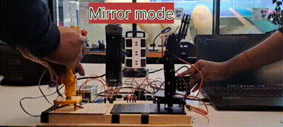

# PuppetArmControl
In this project, the motion of a 4 DOF robotic arm is controlled through a puppet equipped with $10k \Omega$ potentiometers at each joint. Potentiometer readings are filtered to get stable puppet pose measurements. The servos attached to the robotic
arm's joints are controlled accordingly, to mimic the puppet's pose in real-time. 
Features such as Save/Edit, Delete, Cycle are included to enable pose capture and motion reproduction. 

## Components Used
* **Arduino Mega** - For its numerous I/0 pins and low cost
* **$10k \Omega$ Potentiometer** - To measure puppet's joint angles
* **SG-90 Servo motors** - For precise actuation of robotic arm joints
* **4x4 Keypad** - Interface for accessing saved states and program modes
* **12V SMPS and 12 to 5V Buck converter** - For powering all the components

## Measuring Puppet Pose
The output of the potentiometer attached to the analog input pins in the Arduino Mega reads between 0 and 1023, because of the 10-bit ADC in the Mega. These values are mapped to the physical angular constraints of the potentiometer. 
To minimize measurement noise, 10 continuous readings are taken, and outliers are removed assuming gaussian nature of the measurement. The average of the remaining mesurements is taken as the final measurement. 

## Saving a pose
The 4 joint angles define the pose of the robot. Arduino Mega's EEPROM is used to store different puppet poses in order. The program here allows for storage of 10 states, considering Arduino Mega's limited EEPROM capacity.  

## Operating Mode
The following modes are programmed to employ puppet mirroring as an usable robot programming feature:
- **Save/Edit** - This mode captures the puppet pose and stores it in the EEPROM, tagged with chosen state ID (0 to 9)
- **Delete** - This enables deletion of chosen state
- **Cycle** - This mode cycles through the saved states in order of their state IDs, achieving series of motions for operations such as pick and place

## Result and scope of improvement

  

The puppet mirroring works reasonably well with the signal filtering method discussed above. However, further improvements can be made to the puppet mechanical design or more advanced filtering techniques can be employed to eliminate noise 
caused by vibrations from human hands.
